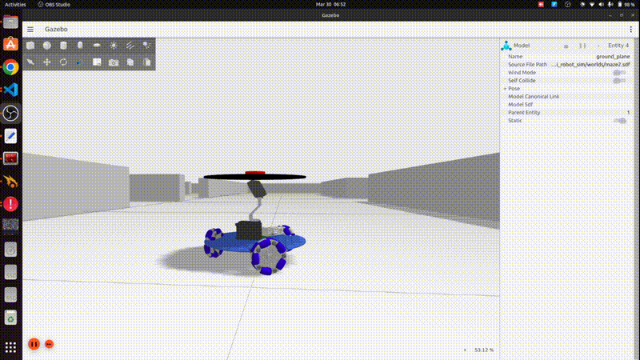
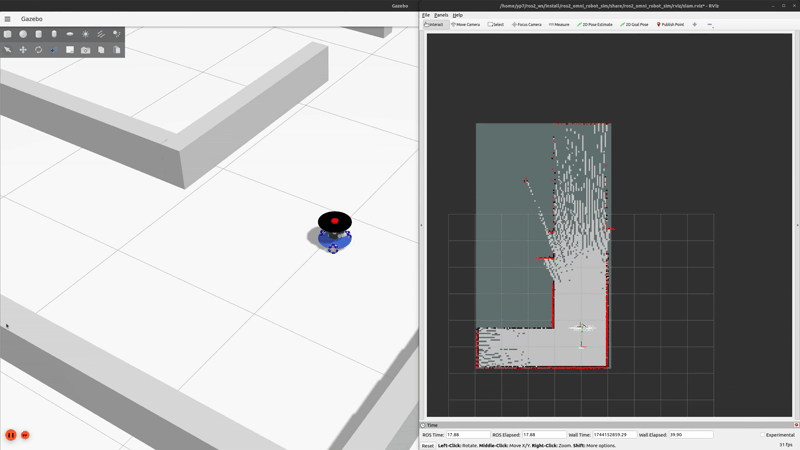
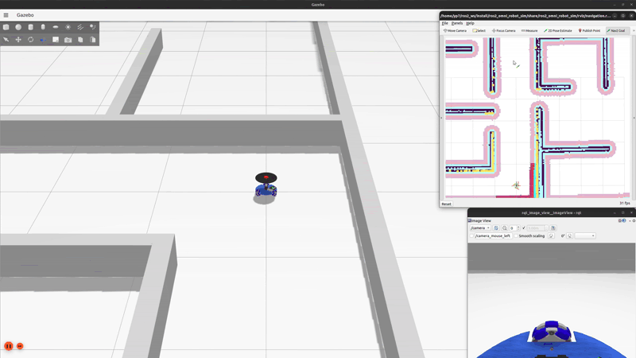

# Three-Wheeled Omnidirectional Gazebo Simulation

## Introduction

This repository contains a Gazebo Ignition  simulation that can be run with ROS2 for a 3-wheeled omnidirectional robot, useful for robotics research and simulation.

### Tested on

- Ubuntu 22.04
- ROS Humble
- Gazebo Ignition Fortres

## How to run

Please clone this repository to your ros2 workspace. The following assume your ros2 work space placed on your home directory with named **ros2_ws**

```bash
cd ~/ros2_ws/src
git git@github.com:YePeOn7/ros2_omni_robot_sim.git
cd ~/ros2_ws
colcon build
source install/setup.bash
```

After that you can run several simulation

### 1. Manual Teleop

```bash
ros2 launch ros2_omni_robot_sim gazebo_sim.launch.py
```

or you can specity the world as follow

```bash
ros2 launch ros2_omni_robot_sim gazebo_sim.launch.py world:=<world_name>
```

*please refer to [World Options](#world-options) Section for <world_name>*



### 2. SLAM with slam_toolbox

Start the SLAM by using the following command

```bash
ros2 launch ros2_omni_robot_sim slam_gazebo_sim.launch.py

# with specific world
ros2 launch ros2_omni_robot_sim slam_gazebo_sim.launch.py world:=<world_name>
```

*please refer to [World Options](#world-options) Section for <world_name>*



Save the map by using the following command

```bash
cd ~/ros2_ws/ros2_omni_robot_sim/map # You can use other folder, however you need reconfigure the launch file to use your map
ros2 run nav2_map_server map_saver_cli -f <map_name>
```

**Recommendation**: It is advised to use the **world name** as the **`<map_name>`** when saving your map. This ensures the map is automatically picked up by the launch file without additional configuration.

- For example: If your world is named **`maze1`**, name your map **`maze1`** as well.
- Saved files will be: `maze1.pgm` and `maze1.yaml`.

This consistency simplifies navigation setup and avoids manual path adjustments in your ROS 2 launch files.

### 3. Navigation

Start the SLAM by using the following command

```bash
ros2 launch ros2_omni_robot_sim navigation_gazebo_sim.launch.py

# with specific world
ros2 launch ros2_omni_robot_sim navigation_gazebo_sim.launch.py world:=<world_name>
```

*please refer to [World Options](#world-options) Section for <world_name>*



## World Options

- maze1
- maze2 (default)
